# Python projects

## OpenCV 


### Distance to camera 

<p>Обнаружение расстояния до камеры. Если мы находимся слишком близко к камере, то загарается красный квадрат и появляется надпись с предупреждением</p>

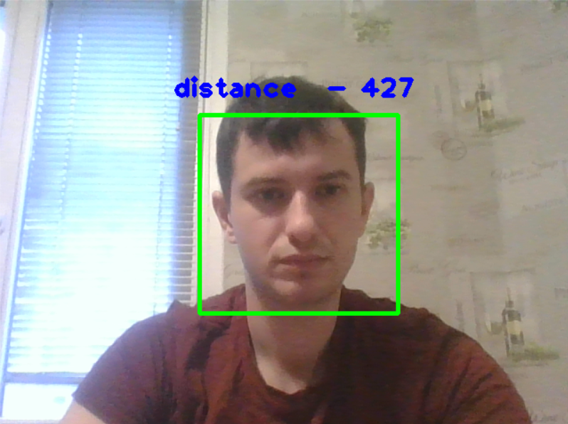
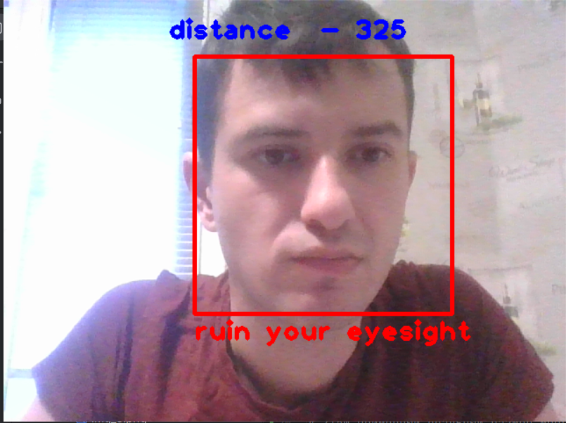


### Detect eyes and signal

<p>Если закрыть глаза на более чем 4 секунды тогда звучит сигнализация</p>

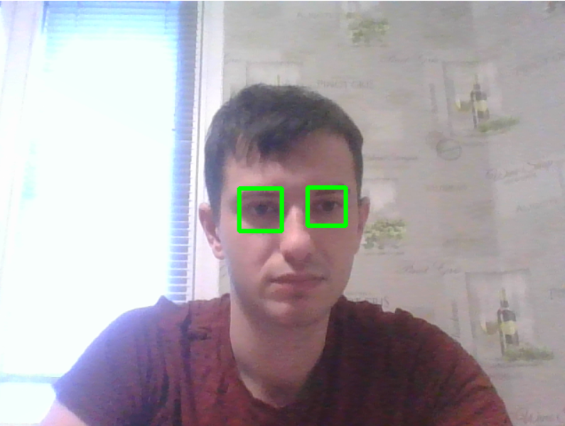

### Detect many faces

<p>Программа определяет на каком расстоянии находятся лица от вебкамер</p>


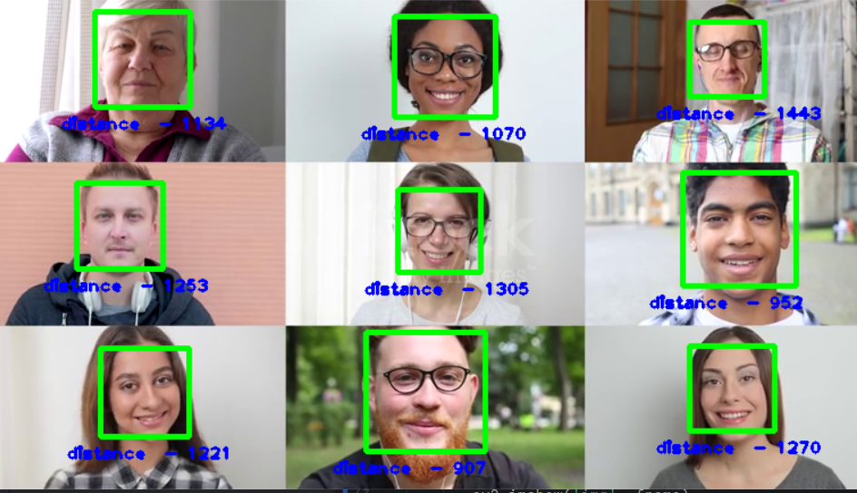

### CatsBlur.py
<p>Это программа предназначена для поиска на изображении объекта, для этого я использовал фильтр Canny и Гаусово размытие. Для того чтобы убрать промежуточные помехи я использовал морфологию</p>


```python
canny = cv2.Canny(img,0,255)
```


```python
blur = cv2.GaussianBlur(img,(59,59),1)
```

### Les13112024FindContours.py

<p>Эта программа находит объекты на изображении, можно регулировать цветовым пространством с помощью ползунков. Можно регулировать пороговые значения площади</p>

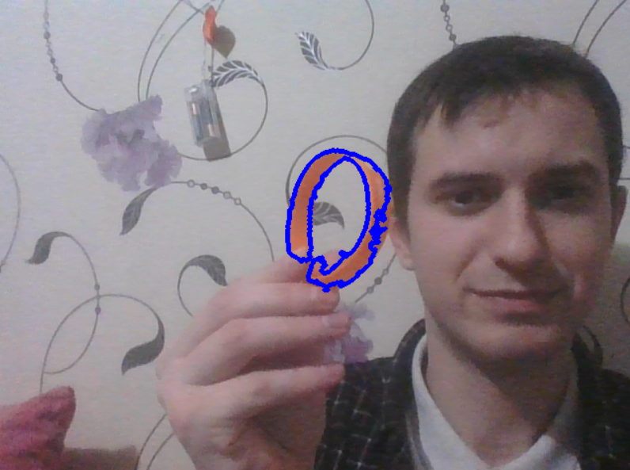

```python

thresh = cv2.inRange( hsv, hsv_max, hsv_min )

contour,hierarchy = cv2.findContours(thresh,cv2.RETR_TREE,cv2.CHAIN_APPROX_SIMPLE)

```
<p> первая команда создает маску для изображения, особо интересные цвета обозначаем белым, остальное черным. Вторая команда находит контура</p>

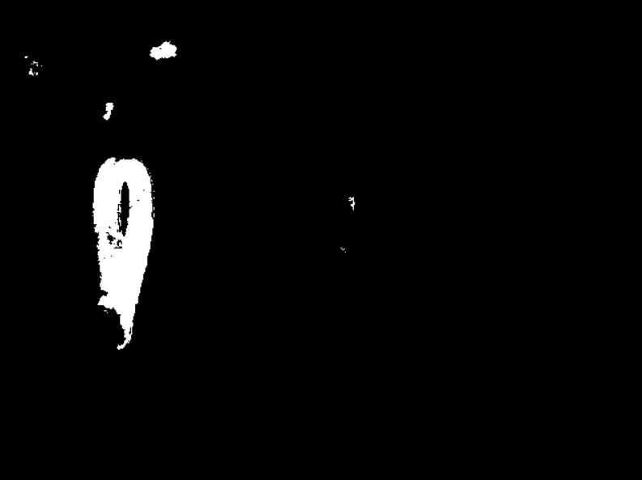

### ApproxFindFigure.py

<p>Эта программа позволяет находить различные формы на изображении</p>

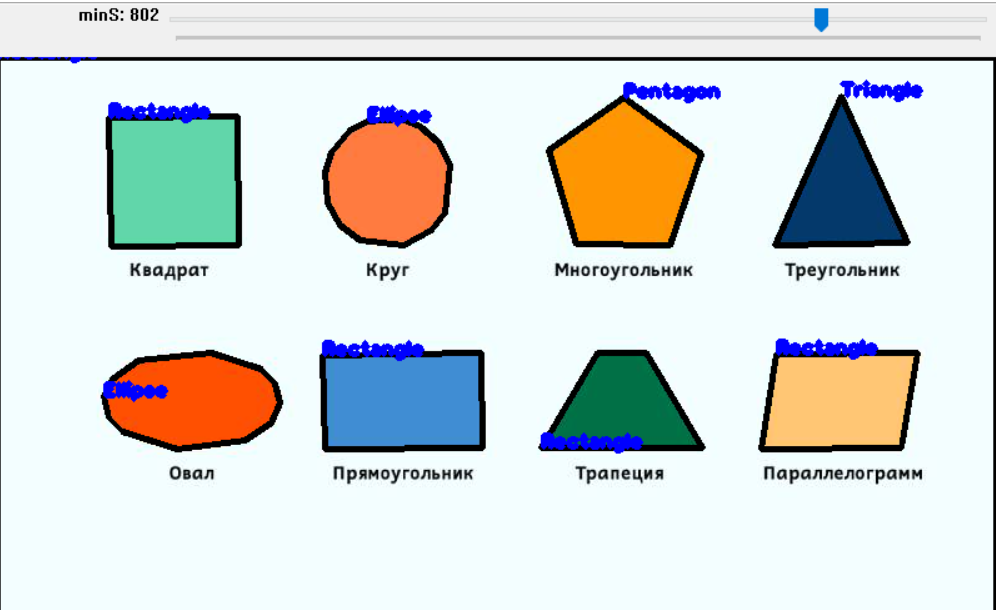


### GaussianBlur.py

<p>Эта программа позволяет работать с изображениями, применять фильтр Canny, исспользовать морфологию</p>

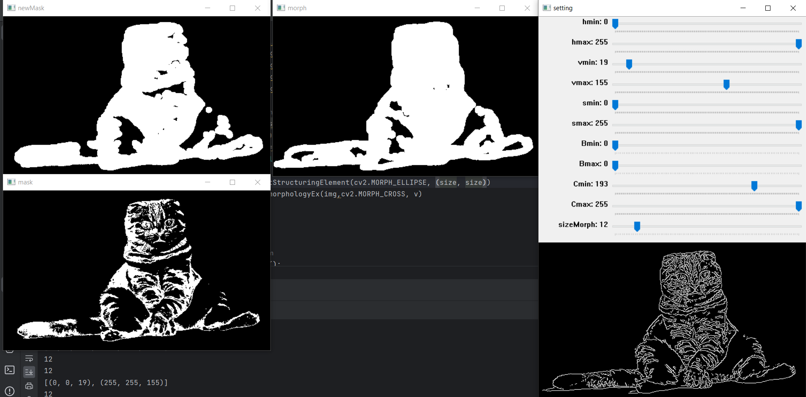


### CannyAndBlur.py

<p>Эта программа позволяет работать с изображениями, применять фильтр Canny, исспользовать морфологию</p>

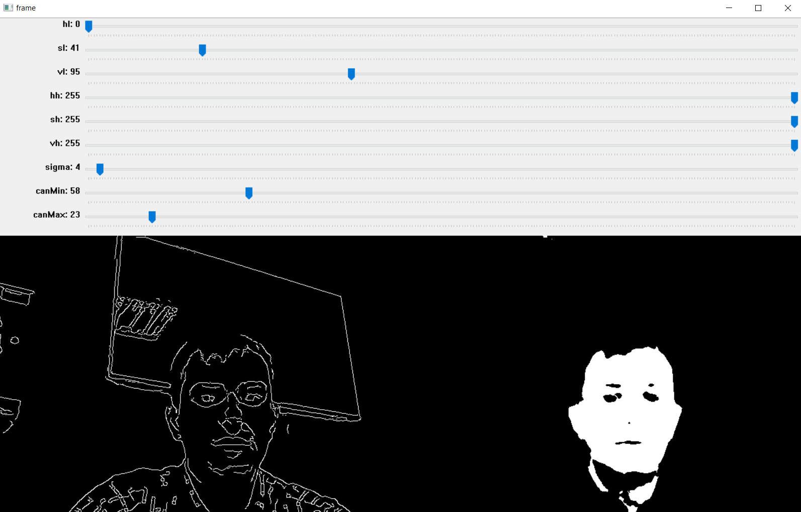


### HaarCascade

<p>Обнаружение лиц с помощью HaarCascade</p>

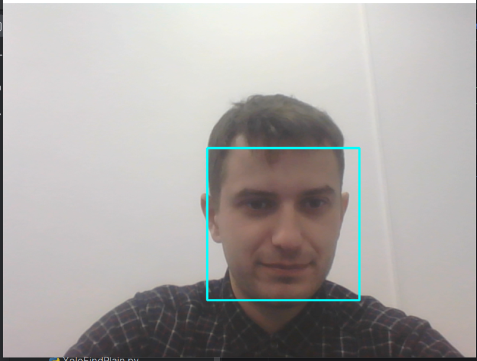

### HaarCascadeWithTelebot

<p>Обнаружение лиц с помощью каскадов Хаара</p>

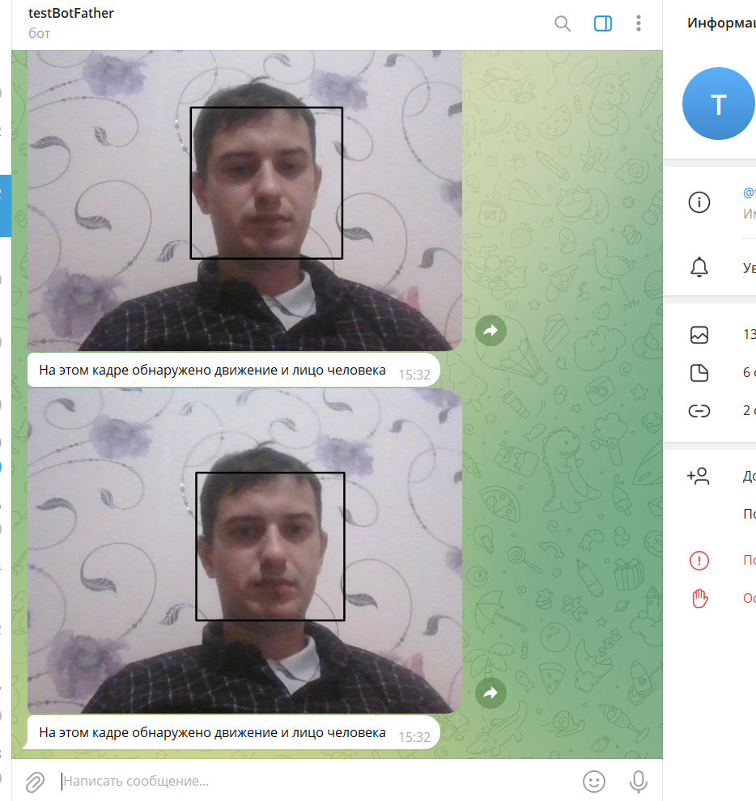

<p>Если есть лицо и движение, то программа отправляет сохраненную фотографию в бота</p>

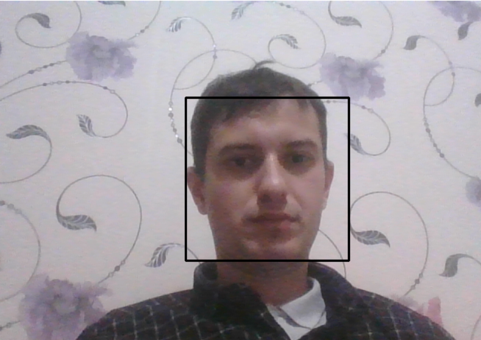

<p>Если есть каждый кадр отнимается от предыдущего кадра и если движение есть то происходит смена цвета на белый </p>

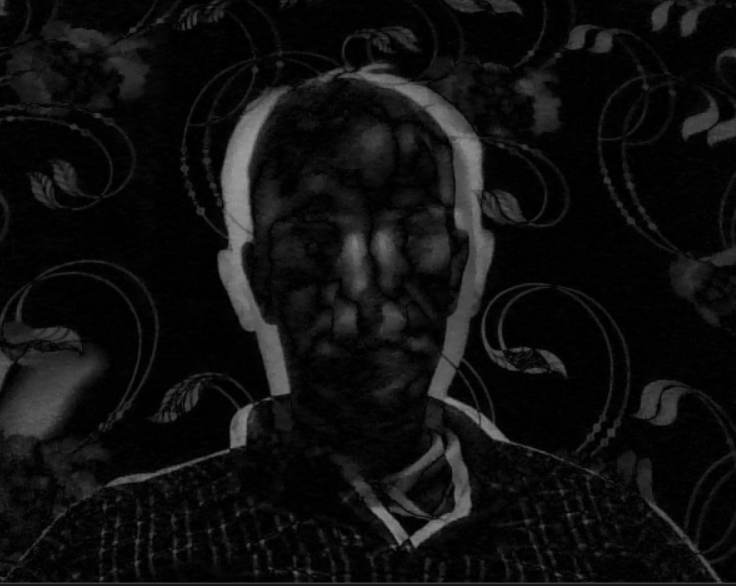


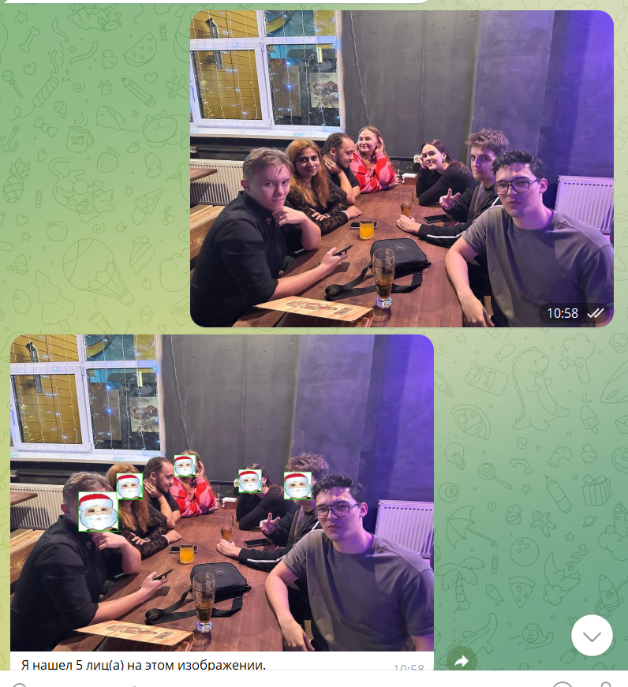

<p>Этот бот нужен для обнаружении лиц на фотографии. Использовал каскады Хаара и телеграмм бота. Программа накладывает на лица картинки</p>

