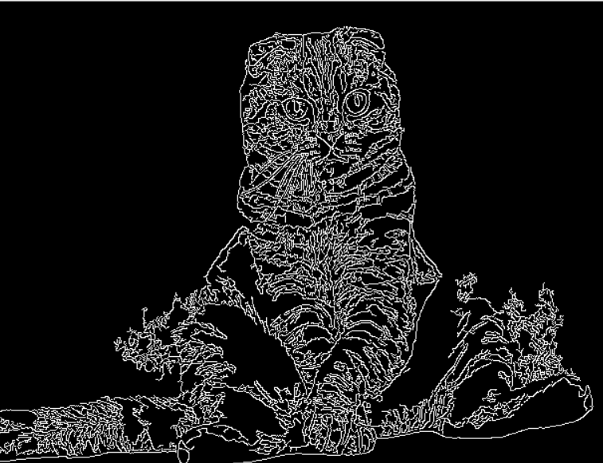
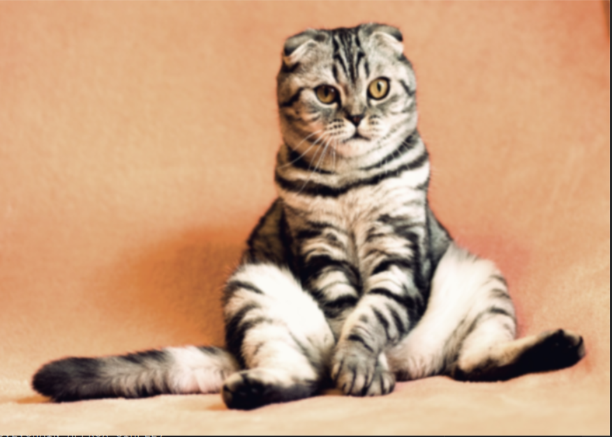

# Python projects

## OpenCV 
### CatsBlur.py
<p>Это программа предназначена для поиска на изображении объекта, для этого я использовал фильтр Canny и Гаусово размытие. Для того чтобы убрать промежуточные помехи я использовал морфологию</p>


```python
canny = cv2.Canny(img,0,255)
```


```python
blur = cv2.GaussianBlur(img,(59,59),1)
```